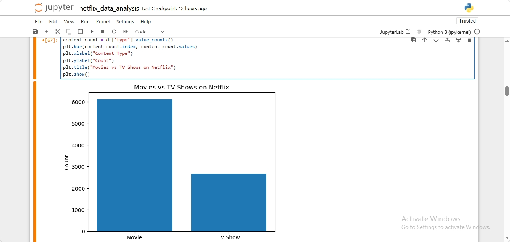
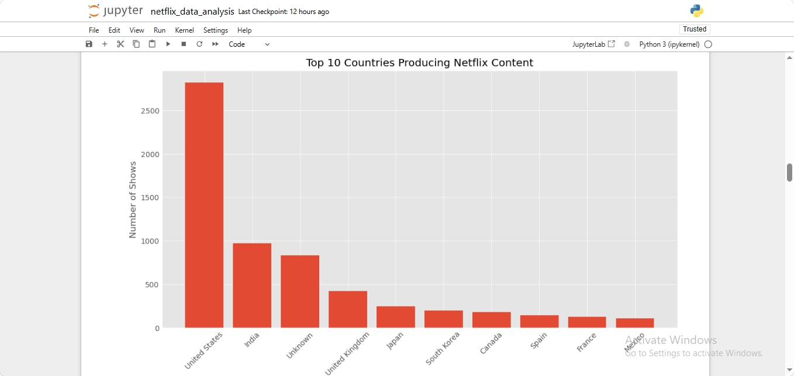
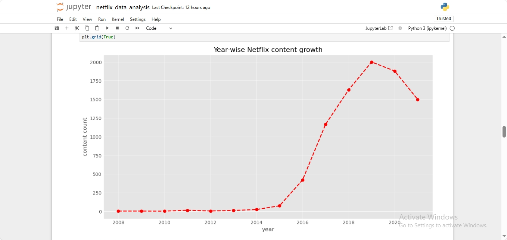
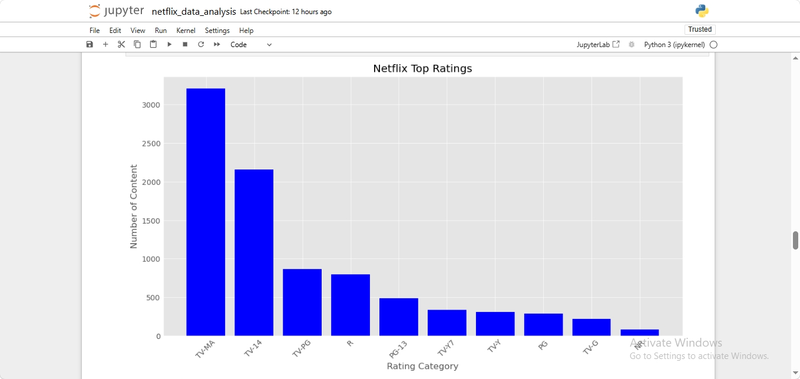
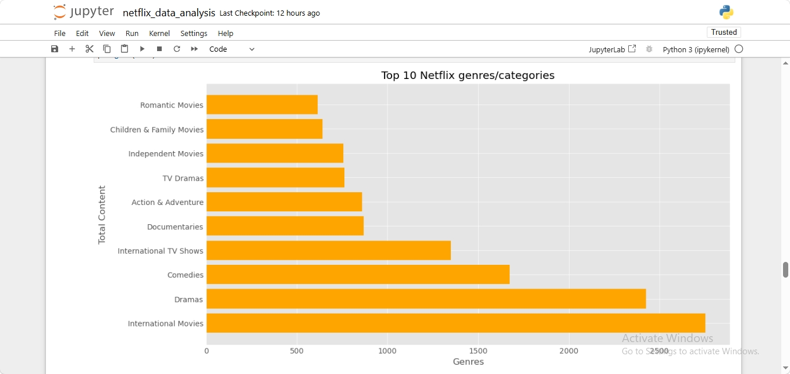
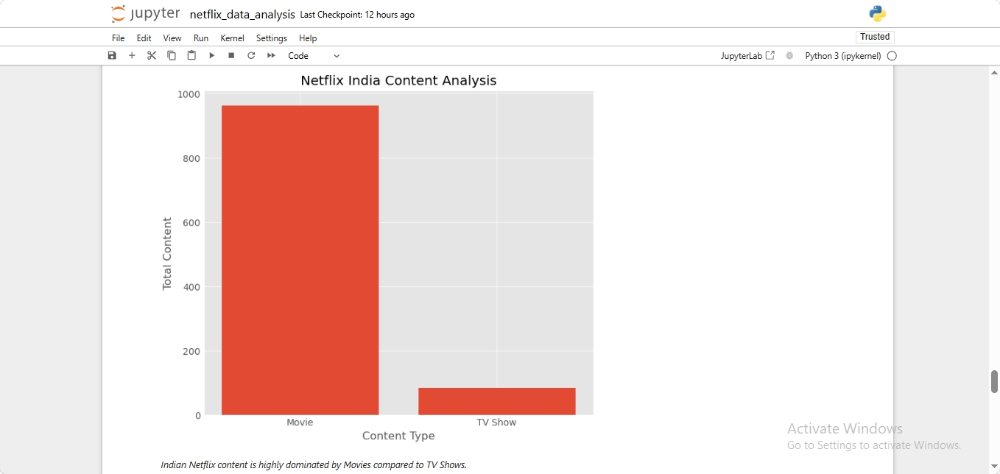

# Netflix Movies & TV Shows Data Analysis 📊

## Project Overview

This project performs Exploratory Data Analysis (EDA) on the Netflix Movies and TV Shows dataset.

The aim of this project is to analyze Netflix content trends, understand content distribution, and discover insights related to genres, countries, ratings, and yearly content growth.

---

## Dataset

Dataset Used: Netflix Movies and TV Shows Dataset  

Source: Kaggle

The dataset contains information about:

- Movies
- TV Shows
- Directors
- Cast
- Countries
- Release Year
- Ratings
- Genres
- Date Added

---

## Technologies Used 🛠️

- Python
- NumPy
- Pandas
- Matplotlib
- Seaborn
- Jupyter Notebook

---

## Data Cleaning Steps

Performed:

✔ Removed duplicate records  
✔ Handled missing values  
✔ Converted date_added column into DateTime format  
✔ Extracted year information for analysis  
✔ Processed multiple category columns using split and explode methods  

---

# Exploratory Data Analysis & Outputs 📊

## 1. Movies vs TV Shows Distribution

### Insight
Netflix contains more Movies compared to TV Shows.

---

## 2. Top Content Producing Countries

### Insight
United States and India are among the major Netflix content producing countries.

---

## 3. Netflix Content Growth Over Years

### Insight
Netflix content addition increased rapidly after 2015.

---

## 4. Rating Distribution Analysis

### Insight
TV-MA is one of the most common audience rating categories on Netflix.

---

## 5. Top Netflix Genres

### Insight
International Movies, Dramas and Comedies dominate Netflix content categories.

---

## 6. India Specific Netflix Analysis 🇮🇳

### Insight
Indian Netflix content mainly consists of Movies compared to TV Shows.

---

# Key Insights 🔍

- Netflix has more Movies than TV Shows.
- Content library expanded significantly after 2015.
- International Movies and Dramas are the most common categories.
- Mature audience content has a strong presence on Netflix.
- India is one of the important contributors to Netflix content.

---

# Project Workflow

Dataset Collection  
        ↓  
Data Cleaning  
        ↓  
Exploratory Data Analysis  
        ↓  
Data Visualization  
        ↓  
Insights Generation  

---

# Future Improvements 🚀

- Create interactive dashboard using Power BI
- Add adv# Netflix Movies & TV Shows Data Analysis 📊

## Project Overview

This project performs Exploratory Data Analysis (EDA) on the Netflix Movies and TV Shows dataset.

The aim of this project is to analyze Netflix content trends, understand content distribution, and discover insights related to genres, countries, ratings, and yearly content growth.

---

## Dataset

Dataset Used: Netflix Movies and TV Shows Dataset  

Source: Kaggle

The dataset contains information about:

- Movies
- TV Shows
- Directors
- Cast
- Countries
- Release Year
- Ratings
- Genres
- Date Added

---

## Technologies Used 🛠️

- Python
- NumPy
- Pandas
- Matplotlib
- Seaborn
- Jupyter Notebook

---

## Data Cleaning Steps

Performed:

✔ Removed duplicate records  
✔ Handled missing values  
✔ Converted date_added column into DateTime format  
✔ Extracted year information for analysis  
✔ Processed multiple category columns using split and explode methods  

---

# Exploratory Data Analysis & Outputs 📊

## 1. Movies vs TV Shows Distribution

### Insight
Netflix contains more Movies compared to TV Shows.

---

## 2. Top Content Producing Countries

### Insight
United States and India are among the major Netflix content producing countries.

---

## 3. Netflix Content Growth Over Years

### Insight
Netflix content addition increased rapidly after 2015.

---

## 4. Rating Distribution Analysis

### Insight
TV-MA is one of the most common audience rating categories on Netflix.

---

## 5. Top Netflix Genres

### Insight
International Movies, Dramas and Comedies dominate Netflix content categories.

---

## 6. India Specific Netflix Analysis 🇮🇳

### Insight
Indian Netflix content mainly consists of Movies compared to TV Shows.

---

# Key Insights 🔍

- Netflix has more Movies than TV Shows.
- Content library expanded significantly after 2015.
- International Movies and Dramas are the most common categories.
- Mature audience content has a strong presence on Netflix.
- India is one of the important contributors to Netflix content.

---

# Project Workflow

Dataset Collection  
        ↓  
Data Cleaning  
        ↓  
Exploratory Data Analysis  
        ↓  
Data Visualization  
        ↓  
Insights Generation  

---

# Future Improvements 🚀

- Create interactive dashboard using Power BI
- Add advanced statistical analysis
- Build a recommendation system using Machine Learning

---

# Conclusion

Through this project, Netflix content trends were analyzed using Python libraries.  
The analysis helped discover patterns in content type, genres, countries, ratings and yearly growth.

---

# Author

Created by Lakshitaanced statistical analysis
- Build a recommendation system using Machine Learning

---

# Conclusion

Through this project, Netflix content trends were analyzed using Python libraries.  
The analysis helped discover patterns in content type, genres, countries, ratings and yearly growth.

---

# Author

Created by Lakshita
